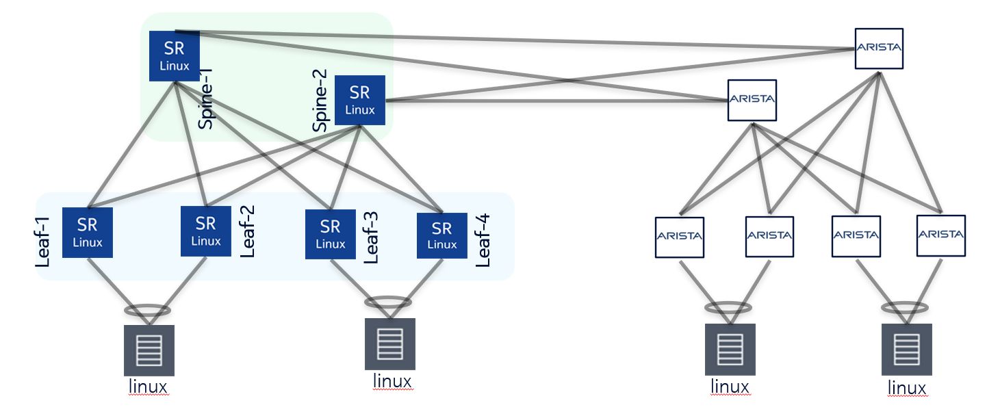

# nokia-arista

A multi-vendor EVPN-VXLAN data-center fabric in [containerlab](https://containerlab.dev): two leaf-spine pods — one Nokia **SR Linux**, one Arista **cEOS** — joined into a single stretched overlay so that four hosts across both pods reach each other over L2 and L3.



## What this lab demonstrates

- A **single EVPN-VXLAN domain spanning two different vendors** — Nokia SR Linux 26.3.2 and Arista cEOS 4.34.2.1F — interoperating purely over open standards (IS-IS, BGP-EVPN, VXLAN).
- A **multi-area IS-IS underlay** that knits two pods together: each pod is its own IS-IS area, joined by a Level-2-only spine-to-spine full mesh, with all loopbacks reachable end-to-end and **no route leaking**.
- A **single iBGP-EVPN control plane** (ASN 65524 everywhere) where the Arista spines act as the EVPN **Route-Reflectors** for every leaf in both pods, while the Nokia spines stay pure IS-IS transit and run no BGP at all.
- **Two stretched L2 services** (BD-A and BD-B) plus a **tenant L3 VRF** that routes between them using **symmetric IRB** — with an **identical anycast gateway MAC across both vendors**.
- **Two different multihoming technologies coexisting** under the same overlay: **EVPN ESI all-active** on the Nokia side and **MLAG** on the Arista side, transparently interoperable because both speak plain EVPN.
- A concrete cross-vendor interop result: **all four dual-homed hosts ping each other**, intra-subnet and inter-subnet.

## Topology

Two pods, each a 2-spine / 4-leaf design, joined by a 4-link spine-to-spine full mesh that carries IS-IS Level-2.

```
                        INTER-POD SPINE FULL MESH (IS-IS Level-2 only, 4 links)
            ┌───────────────────────────────────────────────────────────────────┐
            │                                                                     │
   ╔════════╧═════════════════════════╗               ╔═════════════════════════╧════════╗
   ║            POD-NOKIA              ║               ║            POD-ARISTA             ║
   ║   IS-IS area 49.0200             ║               ║   IS-IS area 49.0078             ║
   ║   loopbacks 10.252.200.x         ║               ║   loopbacks 10.252.183.x         ║
   ║                                  ║               ║                                  ║
   ║   nokia-spine1   nokia-spine2    ║               ║   arista-spine1  arista-spine2   ║
   ║   (IXR-H4)       (IXR-H4)        ║               ║   (EVPN RR)      (EVPN RR)       ║
   ║       │  ╲      ╱  │             ║               ║       │  ╲      ╱  │             ║
   ║       │   ╲    ╱   │             ║               ║       │   ╲    ╱   │             ║
   ║   ┌───┴───┬───┬────┴───┐         ║               ║   ┌───┴───┬───┬────┴───┐         ║
   ║  L1   L2  L3  L4 (IXR-D4)        ║               ║  L5   L6  L7  L8 (cEOS)          ║
   ║  └─┬─┘   └─┬─┘           (ESI)   ║               ║  └─┬─┘   └─┬─┘          (MLAG)   ║
   ║    │       │                     ║               ║    │       │                     ║
   ╚════│═══════│═════════════════════╝               ╚════│═══════│═════════════════════╝
        │       │                                         │       │
       h1      h2                                        h3      h4
   10.110.0.11 10.120.0.12                          10.110.0.13 10.120.0.14
     (BD-A)    (BD-B)                                  (BD-A)     (BD-B)
```

### Nodes

| Pod | Node | Kind | Model (intent) | Role |
|---|---|---|---|---|
| Nokia | `nokia-spine1` | `nokia_srlinux` | 7220 IXR-H4 (`ixr-h4`) | Spine — IS-IS transit (no BGP) |
| Nokia | `nokia-spine2` | `nokia_srlinux` | 7220 IXR-H4 (`ixr-h4`) | Spine — IS-IS transit (no BGP) |
| Nokia | `nokia-leaf1` | `nokia_srlinux` | 7220 IXR-D4 (`ixr-d4`) | Leaf/VTEP — BD-A, ESI (pair w/ leaf2) |
| Nokia | `nokia-leaf2` | `nokia_srlinux` | 7220 IXR-D4 (`ixr-d4`) | Leaf/VTEP — BD-A, ESI (pair w/ leaf1) |
| Nokia | `nokia-leaf3` | `nokia_srlinux` | 7220 IXR-D4 (`ixr-d4`) | Leaf/VTEP — BD-B, ESI (pair w/ leaf4) |
| Nokia | `nokia-leaf4` | `nokia_srlinux` | 7220 IXR-D4 (`ixr-d4`) | Leaf/VTEP — BD-B, ESI (pair w/ leaf3) |
| Arista | `arista-spine1` | `arista_ceos` | DCS7050CX3 *(label only)* | Spine — EVPN Route-Reflector (no VXLAN) |
| Arista | `arista-spine2` | `arista_ceos` | DCS7050CX3 *(label only)* | Spine — EVPN Route-Reflector (no VXLAN) |
| Arista | `arista-leaf5` | `arista_ceos` | DCS7050TX3 *(label only)* | Leaf/VTEP — BD-A, MLAG (pair w/ leaf6) |
| Arista | `arista-leaf6` | `arista_ceos` | DCS7050TX3 *(label only)* | Leaf/VTEP — BD-A, MLAG (pair w/ leaf5) |
| Arista | `arista-leaf7` | `arista_ceos` | DCS7050TX3 *(label only)* | Leaf/VTEP — BD-B, MLAG (pair w/ leaf8) |
| Arista | `arista-leaf8` | `arista_ceos` | DCS7050TX3 *(label only)* | Leaf/VTEP — BD-B, MLAG (pair w/ leaf7) |
| — | `h1`–`h4` | `linux` | network-multitool | Dual-homed test hosts (LACP bond) |

> The Arista `DCS7050xx3` strings are **intent labels only** — cEOS emulates a single generic platform with no hardware-model variants. They document design intent, nothing more (see [Notes & gotchas](#notes--gotchas)).

### Host attachments

Each host bonds `eth1`+`eth2` into a single LACP `bond0` and dual-homes to a leaf pair:

| Host | IP | BD | Leaf A (`eth1`) | Leaf B (`eth2`) | Multihoming |
|---|---|---|---|---|---|
| `h1` | 10.110.0.11/24 | BD-A | `nokia-leaf1:e1-1` | `nokia-leaf2:e1-1` | EVPN ESI all-active |
| `h2` | 10.120.0.12/24 | BD-B | `nokia-leaf3:e1-1` | `nokia-leaf4:e1-1` | EVPN ESI all-active |
| `h3` | 10.110.0.13/24 | BD-A | `arista-leaf5:eth1` | `arista-leaf6:eth1` | MLAG |
| `h4` | 10.120.0.14/24 | BD-B | `arista-leaf7:eth1` | `arista-leaf8:eth1` | MLAG |

### Fabric ports

| Link | Nokia pod | Arista pod |
|---|---|---|
| Leaf → spine uplinks | `e1-33` → spine1, `e1-34` → spine2 (unnumbered) | `Ethernet2` → spine1, `Ethernet3` → spine2 (numbered /31) |
| Spine → leaf downlinks | `e1-1`..`e1-4` | `Ethernet3`..`Ethernet6` |
| Inter-pod (spine↔spine) | `e1-21`, `e1-22` (numbered /31) | `Ethernet1`, `Ethernet2` (numbered /31) |
| Multihoming peer-link | none (ESI is peer-link-less) | `Ethernet4`+`Ethernet5` → `Port-Channel1` |
| Host access | `e1-1` | `Ethernet1` |

## Requirements & images

| Component | Version / tag | Notes |
|---|---|---|
| containerlab | tested on **0.75.0** | any recent 0.7x release should work |
| Nokia SR Linux | `ghcr.io/nokia/srlinux:26.3.2` | Pullable from GHCR |
| Arista cEOS | `ceos:4.34.2.1F` | **Must be imported manually** (see below) |
| network-multitool | `ghcr.io/srl-labs/network-multitool:latest` | Pullable from GHCR |

> **cEOS is not pullable.** Arista cEOS images are not published to a public registry. Download `cEOS64-lab-4.34.2.1F.tar.xz` (or the matching tarball) from your Arista account and import it locally so the `ceos:4.34.2.1F` tag exists:
>
> ```bash
> docker import cEOS64-lab-4.34.2.1F.tar.xz ceos:4.34.2.1F
> ```
>
> The SR Linux and network-multitool images pull automatically on first deploy.

## Deploy

```bash
sudo containerlab deploy -t nokia-arista.clab.yaml
```

> **Allow ~90 s for convergence.** Every node sets the IS-IS **overload bit on boot for 90 seconds** (`overload on-boot` / `set-overload-bit on-startup 90`). The fabric stays out of the transit path until that timer expires, so BGP-EVPN sessions, MAC/IP learning, and end-to-end pings settle roughly 90 seconds after the deploy completes. A first ping right after deploy may fail — wait it out.

## Addressing & design

### Loopbacks, IS-IS areas & NET

| Node | Loopback / Router-ID (VTEP if leaf) | IS-IS area | NET |
|---|---|---|---|
| `nokia-spine1` | 10.252.200.101 | 49.0200 | 49.0200.0102.5220.0101.00 |
| `nokia-spine2` | 10.252.200.102 | 49.0200 | 49.0200.0102.5220.0102.00 |
| `nokia-leaf1` | 10.252.200.1 | 49.0200 | 49.0200.0102.5220.0001.00 |
| `nokia-leaf2` | 10.252.200.2 | 49.0200 | 49.0200.0102.5220.0002.00 |
| `nokia-leaf3` | 10.252.200.3 | 49.0200 | 49.0200.0102.5220.0003.00 |
| `nokia-leaf4` | 10.252.200.4 | 49.0200 | 49.0200.0102.5220.0004.00 |
| `arista-spine1` | 10.252.183.201 | 49.0078 | 49.0078.0102.5218.3201.00 |
| `arista-spine2` | 10.252.183.202 | 49.0078 | 49.0078.0102.5218.3202.00 |
| `arista-leaf5` | 10.252.183.5 (VTEP 10.252.183.55) | 49.0078 | 49.0078.0102.5218.3005.00 |
| `arista-leaf6` | 10.252.183.6 (VTEP 10.252.183.55) | 49.0078 | 49.0078.0102.5218.3006.00 |
| `arista-leaf7` | 10.252.183.7 (VTEP 10.252.183.57) | 49.0078 | 49.0078.0102.5218.3007.00 |
| `arista-leaf8` | 10.252.183.8 (VTEP 10.252.183.57) | 49.0078 | 49.0078.0102.5218.3008.00 |

> Arista leaves are MLAG pairs and share a **common VTEP loopback** per pair: leaf5+leaf6 → `10.252.183.55`, leaf7+leaf8 → `10.252.183.57`. Every node is `level-1-2`.

### Inter-pod spine links (numbered /31s, Level-2 only)

| Nokia side | IP | Arista side | IP |
|---|---|---|---|
| `nokia-spine1:e1-21` | 10.252.183.161/31 | `arista-spine1:eth1` | 10.252.183.160/31 |
| `nokia-spine1:e1-22` | 10.252.183.163/31 | `arista-spine2:eth1` | 10.252.183.162/31 |
| `nokia-spine2:e1-21` | 10.252.183.165/31 | `arista-spine1:eth2` | 10.252.183.164/31 |
| `nokia-spine2:e1-22` | 10.252.183.167/31 | `arista-spine2:eth2` | 10.252.183.166/31 |

> Inter-pod links are **numbered** /31s on the **same subnet** on both ends (Arista p2p IS-IS requires same-subnet adjacencies). Intra-Nokia spine↔leaf links stay **IPv4-unnumbered** (borrowing `system0.0`); intra-Arista spine↔leaf links are numbered /31s.

### Hosts

| Host | IP / mask | BD / subnet | Default gateway (anycast) |
|---|---|---|---|
| `h1` | 10.110.0.11/24 | BD-A / 10.110.0.0/24 | 10.110.0.1 |
| `h2` | 10.120.0.12/24 | BD-B / 10.120.0.0/24 | 10.120.0.1 |
| `h3` | 10.110.0.13/24 | BD-A / 10.110.0.0/24 | 10.110.0.1 |
| `h4` | 10.120.0.14/24 | BD-B / 10.120.0.0/24 | 10.120.0.1 |

> Each host bonds `eth1`+`eth2` into `bond0` (LACP 802.3ad, `miimon 100`, `lacp_rate fast`) and assigns its data IP/gateway to `bond0`. The management `eth0` stays on a separate policy route table (table 100 via 172.20.20.1) and is **not** the data-plane gateway.

### Services

Two L2 bridge-domains stretched across **both** pods, plus one tenant L3 VRF (L3 VNI 50001) routing between them via symmetric IRB.

| Service | VLAN (Arista) | L2 VNI | L3 VNI | Subnet | Anycast GW | L2 RT | L3 RT |
|---|---|---|---|---|---|---|---|
| **BD-A** | 110 | 10110 | 50001 | 10.110.0.0/24 | 10.110.0.1 | 65524:10110 | 65524:50001 |
| **BD-B** | 120 | 10120 | 50001 | 10.120.0.0/24 | 10.120.0.1 | 65524:10120 | 65524:50001 |

- **Anycast gateway MAC (both vendors, all leaves):** `00:1c:73:01:78:ff` — identical on SR Linux (`anycast-gw-mac`, `virtual-router-id 1`) and cEOS (`ip virtual-router mac-address`).
- **Tenant VRF** `tenant` carries **L3 VNI 50001** with RT `65524:50001` on all leaves (route distinguishers differ per-leaf by router-ID). This is what routes BD-A ↔ BD-B.
- L2 route-distinguishers are per-leaf `<router-id>:<L2VNI>` (e.g. `10.252.200.1:10110`, `10.252.183.5:10110`).
- Served by: BD-A → Nokia leaf1/leaf2 + Arista leaf5/leaf6; BD-B → Nokia leaf3/leaf4 + Arista leaf7/leaf8.

## Underlay (IS-IS)

A **multi-area IS-IS** fabric. Each pod is its own area; the pods join over a Level-2-only spine mesh.

- **Per-pod areas:** Nokia pod = `49.0200`, Arista pod = `49.0078`. Every node is **Level-1-2**.
- **Intra-pod links** carry both levels. The Level-2 backbone runs spine→spine across the inter-pod mesh; those four links are pinned **Level-2 only** (`level 1 disable true` on SR Linux, `isis circuit-type level-2` on cEOS).
- **All loopbacks are reachable everywhere** with **no route leaking** — there's no redistribution between areas; standard L1/L2 IS-IS behaviour floods L2 prefixes across the backbone so every VTEP and RR loopback resolves end to end.
- **AF scope:** IS-IS is **IPv4-only** (IPv6 unicast disabled on inter-pod links).
- **MTU:** SR Linux runs `default-ip-mtu 9000` / `default-l2-mtu 9214`; cEOS inter-pod links are `mtu 9000`, leaf fabric links `mtu 9214`.

### Cross-vendor IS-IS caveat (the silent killer)

Getting an SR Linux ↔ cEOS IS-IS adjacency up requires three things to line up:

1. **Numbered, same-subnet /31s** on the inter-pod links — Arista's point-to-point IS-IS will not form an adjacency across mismatched subnets. (Intra-Nokia links can stay unnumbered; the cross-vendor ones cannot.)
2. **Hello padding disabled / loosened on both sides** — cEOS: `no isis hello padding`; SR Linux: `hello-padding loose`.
3. **Matched MTU** — both ends at 9000 on the inter-pod links. **MTU mismatch is the classic silent failure**: hellos with full-MTU padding are dropped and the adjacency never comes up, with no obvious error.

> **Why hello padding matters here:** the two vendors compute the IS-IS PDU MTU slightly differently — SR Linux pads hellos to `ip-mtu − 8` ≈ **8992 bytes**, while cEOS sets its IS-IS MTU to `port-mtu − 3` ≈ **8997 bytes**. With both inter-pod interfaces at MTU 9000 and padding loosened, cEOS accepts SR Linux's 8992-byte hello. Drop the MTU on the cEOS side (or leave full padding on) and that hello gets silently discarded before parsing — which is exactly the trap that makes every *other* field look like the culprit.

The SR Linux side additionally pins these inter-pod links **IPv4-only** with **Level-2 only**.

## Overlay (BGP-EVPN)

One iBGP-EVPN domain, **ASN 65524 everywhere**.

- **Route-Reflectors = the two Arista spines** (`arista-spine1` = 10.252.183.201, `arista-spine2` = 10.252.183.202). Each runs `bgp cluster-id` = its own loopback and reflects EVPN to all clients.
- **RR clients = all 8 leaves** (4 Nokia + 4 Arista), each peering to **both** RRs:
  - Nokia leaf router-IDs: `10.252.200.1`–`10.252.200.4`
  - Arista leaf router-IDs: `10.252.183.5`–`10.252.183.8`
- The two RRs are **iBGP-peered to each other** (not RR-clients of one another).
- **Nokia spines run no BGP** — they are pure IS-IS transit. The Arista spines are RR-only and carry **no VXLAN interface**; only the leaves are VTEPs.
- **Address families:** EVPN activated everywhere; IPv4-unicast disabled (`no bgp default ipv4-unicast` on cEOS, `ipv4-unicast admin-state disable` on SR Linux). Sessions are sourced from loopbacks (`update-source Loopback0` / `transport local-address system0`), reachable via the IS-IS underlay.
- **Expected EVPN session count per RR:** 9 (8 leaf clients + 1 peer RR).

Each RR's expected established neighbor list (both spines reflect to the same set):

```
10.252.200.1   10.252.200.2   10.252.200.3   10.252.200.4   (Nokia leaves)
10.252.183.5   10.252.183.6   10.252.183.7   10.252.183.8   (Arista leaves)
10.252.183.202 / .201                                       (peer RR)
```

## Multihoming (ESI vs MLAG)

Each host is dual-homed to a leaf pair, but the two pods do it **differently** — and both work under the same EVPN overlay because the multihoming method is local to each pod and only standard EVPN crosses the wire.

| | Nokia pod | Arista pod |
|---|---|---|
| Method | **EVPN ESI, all-active** | **MLAG** |
| Pairs | leaf1+leaf2 (h1), leaf3+leaf4 (h2) | leaf5+leaf6 (h3), leaf7+leaf8 (h4) |
| Shared identity | ESI per pair (`00:00:01:…:10` for leaf1/2, `00:00:02:…:20` for leaf3/4); LAG `system-id-mac` + `admin-key` shared across the pair | MLAG domain (`POD-AB-56`, `POD-AB-78`); shared VTEP loopback per pair; MLAG peer SVI `Vlan4094` (/31) over the `Port-Channel1` peer-link |
| Host side | LACP `lag1` (active, fast) | LACP MLAG port-channel (`Port-Channel10`/`20`, `mlag` id) |

- **Nokia ESI all-active:** both leaves in a pair advertise the same Ethernet Segment; one is elected Designated Forwarder per BD; both forward unicast. No inter-leaf peer-link is needed.
- **Arista MLAG:** the pair runs a peer-link (`Ethernet4`+`Ethernet5` → `Port-Channel1`) carrying the control-plane `Vlan4094` peer SVI, presents a single LACP system to the host, and shares one VTEP source loopback so the rest of the fabric sees one VTEP per pair.
- **Interop:** to the remote pod, both look like ordinary EVPN VTEPs advertising MAC/IP routes — no vendor-specific multihoming signaling crosses the inter-pod boundary.

## Verification

Run these after the ~90 s overload timer clears.

**Nokia IS-IS adjacencies** (expect 6 per spine: 4 × L1L2 to local leaves + 2 × L2 to Arista spines):

```bash
docker exec nokia-spine1 sr_cli -d "show network-instance default protocols isis adjacency"
docker exec nokia-spine2 sr_cli -d "show network-instance default protocols isis adjacency"
```

**Arista IS-IS neighbors** (expect both Nokia spines as `L2 / UP`, plus 4 × L1L2 to local leaves):

```bash
docker exec arista-spine1 Cli -p 15 -c "show isis neighbors"
docker exec arista-spine2 Cli -p 15 -c "show isis neighbors"
```

**BGP-EVPN on the RRs** (expect 9 neighbors, all `Estab`):

```bash
docker exec arista-spine1 Cli -p 15 -c "show bgp evpn summary"
docker exec arista-spine2 Cli -p 15 -c "show bgp evpn summary"
```

**Arista MLAG health:**

```bash
docker exec arista-leaf5 Cli -p 15 -c "show mlag"
```

**Nokia Ethernet-Segment / DF election** (SR Linux 26.3.2 path — no `protocols evpn` prefix):

```bash
docker exec nokia-leaf1 sr_cli -d "show system network-instance ethernet-segments h1_esi detail"
```

**Host ping matrix** — confirm all four hosts reach each other (intra- and inter-subnet):

```bash
for s in h1 h2 h3 h4; do
  for d in 10.110.0.11 10.120.0.12 10.110.0.13 10.120.0.14; do
    docker exec "$s" ping -c3 -W2 "$d"
  done
done
```

### Live result (captured 2026-06-05)

- **Nodes:** 16/16 running, `RestartCount=0` on every node (12 switches + 4 hosts).
- **Nokia IS-IS:** each spine has 6 adjacencies up — 4 to local leaves + **2 Level-2 to the Arista spines**.
- **Arista IS-IS:** both spines show both Nokia spines as `L2 / UP`, plus 4 L1L2 to local leaves.
- **BGP-EVPN:** **9/9 Established** on both Arista RRs.
- **MLAG (`arista-leaf5`):** domain `POD-AB-56`, state `Active`, peer-link `Up`, peer-config `consistent`.
- **Nokia ES (`h1_esi`):** Oper `up`, all-active, DF elected = `10.252.200.1` (candidates `.1` DF + `.2`).
- **Ping matrix:** **all 12 directed host pairs at 0% loss** in steady state (avg ~3 ms intra-subnet, ~10–15 ms cross-pod routed). The very first packet on a cold path can drop while ARP/MAC is learned, then it's clean.

## Notes & gotchas

- **IXR-D4 has only 36 ports → leaf uplinks renumbered.** The 7220 IXR-D4 exposes `ethernet-1/1..36`, so the canonical `e1-49`/`e1-50` uplinks **do not exist**. Nokia leaf uplinks use **`e1-33` → spine1** and **`e1-34` → spine2** instead. Don't copy a `1/49`/`1/50` uplink convention onto a D4. (Verify any SR Linux platform's real port inventory with `sr_cli -d "info from state interface *"`.)
- **cEOS has no hardware-model variants.** The `DCS7050CX3` / `DCS7050TX3` strings in the topology are **documentation/intent only** — cEOS emulates one generic platform and ignores the label. Treat them as "what this would be on real hardware," not as configuration that changes behaviour.
- **Overload-on-boot is 90 s.** Both vendors set the IS-IS overload bit for 90 seconds at boot to keep traffic off the fabric until it's fully converged. Plan for ~90 s after `deploy` before EVPN/pings work; an immediate test will look broken when it isn't.
- **Cross-vendor MTU is the silent killer.** The SR Linux ↔ cEOS inter-pod IS-IS adjacency only comes up when **MTU matches on both ends** (9000 here) **and** hello padding is relaxed (`no isis hello padding` / `hello-padding loose`) over **numbered same-subnet /31s**. A bare MTU mismatch drops padded hellos with no obvious error — check this first if an inter-pod adjacency won't form.
- **Vendor-specific show paths differ.** SR Linux uses `sr_cli -d "…"`; cEOS uses `Cli -p 15 -c "…"`. On SR Linux 26.3.2 the Ethernet-Segment command path has **no `protocols evpn` prefix** (`show system network-instance ethernet-segments …`).

## Repository layout

```
nokia-arista/
├── nokia-arista.clab.yaml      # containerlab topology (nodes, links, host bonds)
├── topology.png                # diagram
└── configs/
    ├── nokia-spine1.cfg  nokia-spine2.cfg     # SR Linux — IS-IS transit, no BGP
    ├── nokia-leaf1.cfg … nokia-leaf4.cfg      # SR Linux — IS-IS + iBGP-EVPN + ESI + IRB
    ├── arista-spine1.cfg  arista-spine2.cfg   # cEOS — IS-IS + EVPN route-reflector
    └── arista-leaf5.cfg … arista-leaf8.cfg    # cEOS — IS-IS + iBGP-EVPN + MLAG + IRB
```
